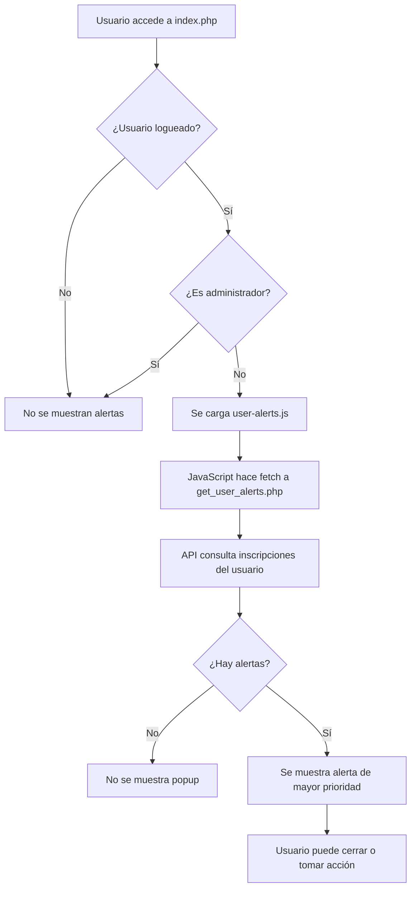

# 🎯 Sistema de Notificaciones de Usuario - Legend Dance Academy

## 📋 Resumen del Sistema

Se ha implementado un sistema completo de notificaciones tipo JOptionPane para usuarios de la academia, que les alerta sobre pagos pendientes y estados de inscripción.

## 🏗️ Componentes Implementados

### 1. API de Alertas de Usuario
**Archivo:** `api/get_user_alerts.php`
- **Función:** Endpoint JSON que proporciona alertas estructuradas para usuarios logueados
- **Características:**
  - Verifica sesión de usuario automáticamente
  - Consulta inscripciones inactivas (requieren pago)
  - Consulta inscripciones pendientes (esperando aprobación)
  - Calcula montos totales adeudados
  - Prioriza alertas de pago sobre alertas de aprobación
  - Incluye información detallada de clases (horarios, precios, días pendientes)

### 2. Sistema de Popup JavaScript
**Archivo:** `assets/js/user-alerts.js`
- **Función:** Cliente JavaScript que muestra alertas tipo JOptionPane
- **Características:**
  - Detección automática al cargar la página
  - Popup modal centrado con overlay
  - Animaciones suaves de entrada/salida
  - Diseño responsive para móviles
  - Estilo diferenciado por tipo de alerta
  - Botones de acción contextuales

### 3. Integración en Index
**Archivo:** `views/index.php`
- **Modificación:** Se añadió la carga condicional del sistema de alertas
- **Condición:** Solo se activa para usuarios logueados que NO son administradores

### 4. Página de Demostración
**Archivo:** `demo-user-alerts.html`
- **Función:** Permite probar el sistema sin necesidad de datos reales
- **Incluye:** Simulaciones de alertas de pago y aprobación

## 🎨 Tipos de Alertas Implementados

### 1. Alerta de Pago Requerido (priority: 1)
- **Trigger:** Usuario tiene inscripciones con status 'inactive'
- **Apariencia:** Borde rojo, ícono de tarjeta de crédito
- **Contenido:**
  - Lista detallada de clases sin pagar
  - Horarios y precios de cada clase
  - Días transcurridos desde la inscripción
  - Monto total adeudado
  - Botón "Contactar Academia" (redirige a contact.php)

### 2. Alerta de Inscripción Pendiente (priority: 2)
- **Trigger:** Usuario tiene inscripciones con status 'pending'
- **Apariencia:** Borde azul, ícono de reloj
- **Contenido:**
  - Información sobre clases esperando aprobación
  - Mensaje tranquilizador sobre el proceso
  - Botón "Entendido" para cerrar

## 📊 Flujo de Funcionamiento



## 🔧 Configuración Técnica

### Base de Datos
- **Tabla:** `enrollments`
- **Campos clave:**
  - `user_id`: Identificación del usuario
  - `status`: ENUM('pending', 'active', 'inactive')
  - `enrollment_date`: Fecha de inscripción
  - `progress_notes`: Notas adicionales

### Seguridad
- ✅ Verificación de sesión en API
- ✅ Consultas preparadas MySQLi
- ✅ Escape de datos HTML
- ✅ Solo usuarios propios ven sus alertas

### Performance
- ✅ Una sola consulta SQL por usuario
- ✅ Cache de alertas durante la sesión
- ✅ Carga asíncrona del JavaScript
- ✅ Compresión de imágenes Cloudinary

## 🎯 Casos de Uso

### Escenario 1: Usuario con Pago Pendiente
```
María se inscribió a Hip Hop hace 5 días pero no ha pagado.
Al acceder a la página, ve un popup rojo con:
- Detalles de la clase (Hip Hop Intermedio)
- Horario (Martes y Jueves 7:00 PM)
- Precio (₡25,000)
- Días pendientes (5 días)
- Botón para contactar la academia
```

### Escenario 2: Usuario Esperando Aprobación
```
Carlos se inscribió a Ballet Clásico ayer.
Al acceder a la página, ve un popup azul informando:
- Su inscripción está siendo revisada
- Recibirá confirmación pronto
- Su estatus actual es "pendiente"
```

### Escenario 3: Usuario Sin Alertas
```
Ana tiene todas sus clases activas y pagadas.
Al acceder a la página, no ve ningún popup.
Su experiencia de navegación es normal.
```

## 📱 Responsive Design

El sistema se adapta automáticamente a diferentes dispositivos:

- **Desktop:** Popup centrado de 500px máximo
- **Tablet:** Popup al 90% del ancho disponible
- **Móvil:** Popup optimizado para pantallas pequeñas
- **Todos:** Altura máxima 80vh con scroll si es necesario

## 🔮 Funcionamiento en Producción

### Activación Automática
1. Usuario inicia sesión en el sistema
2. Navega a cualquier página con el sistema integrado
3. Si tiene alertas pendientes, aparece el popup automáticamente
4. Solo se muestra la alerta de mayor prioridad

### Gestión por Administrador
1. Vanessa puede cambiar el status de inscripciones desde admin.php
2. Cambios de 'pending' a 'active' eliminan alertas de aprobación
3. Cambios de 'inactive' a 'active' eliminan alertas de pago
4. Sistema actualiza automáticamente en próxima visita del usuario

## 🎨 Ejemplos Visuales

### Alerta de Pago
```
┌─────────────────────────────────────────┐
│  💳 Pago Requerido                     │
│                                         │
│  Tienes 1 clase con pagos pendientes.  │
│  Tu cuenta está INACTIVA hasta         │
│  completar el pago.                     │
│                                         │
│  ┌─────────────────────────────────┐   │
│  │ Detalles de pago:               │   │
│  │                                 │   │
│  │ Hip Hop Intermedio              │   │
│  │ 📅 Mar/Jue 7PM • ₡25,000      │   │
│  │ ⏰ 5 días pendiente            │   │
│  │                                 │   │
│  │ Total a pagar: ₡25,000         │   │
│  └─────────────────────────────────┘   │
│                                         │
│  💳 Contacta con la academia para      │
│     realizar tu pago.                   │
│                                         │
│  [Contactar Academia] [Entendido]      │
└─────────────────────────────────────────┘
```

## 🧪 Pruebas y Demostración

### Demo Interactivo
- **URL:** `/demo-user-alerts.html`
- **Función:** Permite probar ambos tipos de alertas sin datos reales
- **Botones:** "Alerta de Pago" y "Alerta de Inscripción Pendiente"

### Pruebas Recomendadas
1. **Test de Pago:** Cambiar status de inscripción a 'inactive' y acceder al sitio
2. **Test de Pendiente:** Cambiar status a 'pending' y verificar alerta azul
3. **Test de Sin Alertas:** Status 'active' no debe mostrar popups
4. **Test Responsive:** Probar en móvil, tablet y desktop
5. **Test de Admin:** Verificar que administradores no ven alertas

## ⚡ Performance y Optimización

### Optimizaciones Implementadas
- ✅ Carga condicional solo para usuarios no-admin
- ✅ Una sola petición HTTP por sesión
- ✅ CSS y animaciones inline para evitar FOUC
- ✅ Limpieza automática de elementos DOM
- ✅ Event listeners optimizados

### Métricas Esperadas
- **Tiempo de carga:** < 100ms después del DOM ready
- **Memoria:** < 50KB adicionales por sesión
- **Red:** Una petición de ~2KB por usuario
- **UX:** Popup visible en < 300ms

## 🔧 Mantenimiento

### Archivos a Monitorear
1. `api/get_user_alerts.php` - Lógica de alertas
2. `assets/js/user-alerts.js` - Interfaz de usuario
3. `views/index.php` - Integración principal

### Configuraciones Disponibles
- Tipos de alerta (modificar en PHP)
- Prioridades (cambiar en API)
- Estilos visuales (ajustar en JavaScript)
- Texto de mensajes (personalizar en ambos archivos)

## 📈 Beneficios Implementados

### Para la Academia
- ✅ Mejora en comunicación con estudiantes
- ✅ Recordatorios automáticos de pago
- ✅ Reducción de llamadas manuales
- ✅ Mejor experiencia de usuario

### Para los Estudiantes
- ✅ Información clara sobre su estatus
- ✅ Recordatorios útiles de pagos
- ✅ Fácil acceso a contacto con academia
- ✅ Transparencia en el proceso de inscripción

### Para el Sistema
- ✅ Automatización de notificaciones
- ✅ Integración limpia con flujo existente
- ✅ Escalabilidad para nuevos tipos de alerta
- ✅ Mantenimiento simplificado

## 🚀 Estado del Proyecto

✅ **COMPLETADO:** Sistema de notificaciones popup tipo JOptionPane
✅ **COMPLETADO:** API de alertas de usuario con prioridades
✅ **COMPLETADO:** Integración en index.php
✅ **COMPLETADO:** Página de demostración
✅ **COMPLETADO:** Documentación completa

🎯 **LISTO PARA PRODUCCIÓN:** El sistema está completamente implementado y puede activarse inmediatamente.